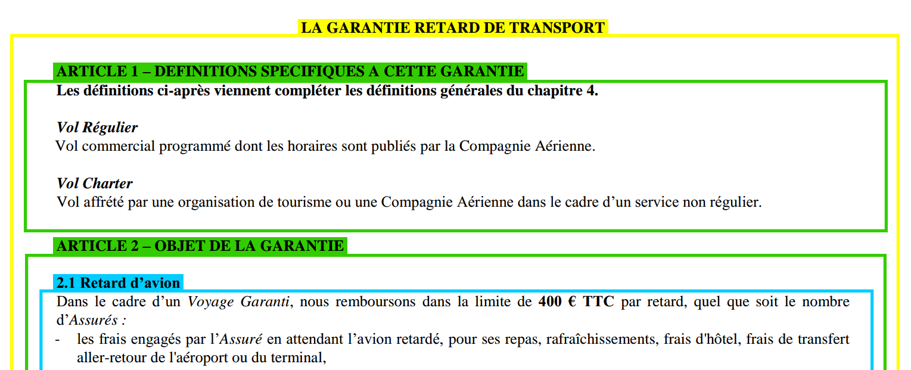

### Structural Parser
**Purpose**: Extract a structured content of a file

## Entity class

Here in the picture above, entity would be "Garantie", "Article", "Sous-article"

* level (int): in the content structure (highest level: 0)
* number (int)
* title (string)
* content (string)
* sub-entities (Entity)
* parent-entity (Entity)
* source (string): path from top to the entity

## Architecture
* Extraction folder
    * class_entity: define the class entity and its dedicated function
    * utils_content: content extraction and cleaning utils
    * utils_dump_load: dump and load function (pickle and txt file)
* Inputs folder
    * contract.pdf: source file
    * contract_spec.py: file structure specification
* Outputs folder
    * content.txt: text content extracted
    * content.pkl: structured content extraction
    * table.txt: table of content extracted
